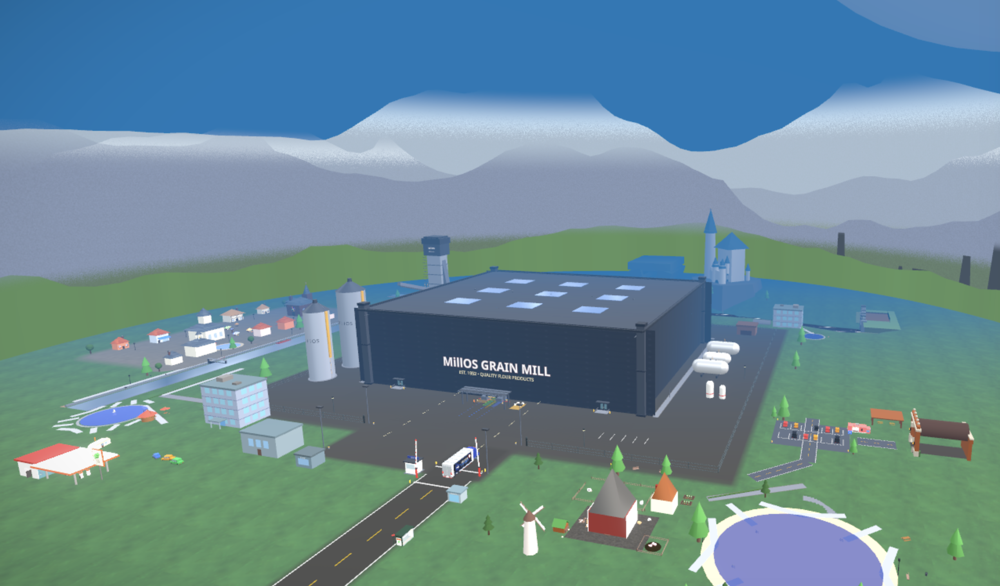
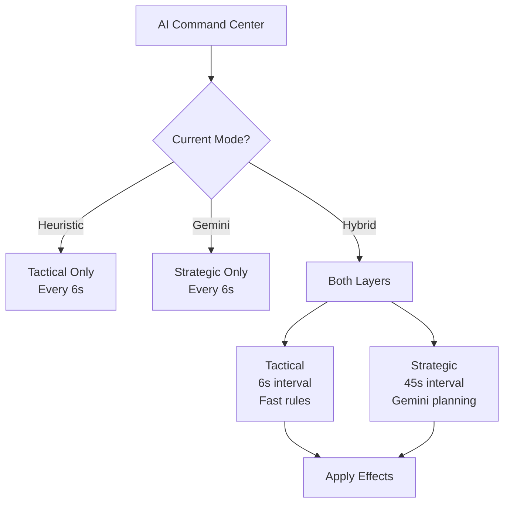

<div align="center">

<br/>

<p>
  
  
  
  
  
</p>

# MillOS

### AI-Powered Grain Mill Digital Twin Simulator with Industrial SCADA Integration

*An Agentic Engineering Experiment by Nell Watson*

<br/>

A browser-based 3D industrial simulation featuring autonomous workers, intelligent forklifts,<br/>real-time production metrics, SCADA integration, and an AI command center — all visualizing a complete grain milling operation.

<br/>

<table>
<tr>
<td></td>
<td></td>
</tr>
<tr>
<td align="center"><em>Factory Interior</em></td>
<td align="center"><em>Factory Exterior</em></td>
</tr>
</table>

<br/>

<a href="https://www.millos.net"></a>

</div>

---

## A Note from Nell Watson

This project represents something I find genuinely exciting about where we are in late 2025: **the emergence of agentic AI as a creative and engineering partner**.

MillOS was not built the traditional way. There is no team of developers who spent months writing boilerplate, debugging physics engines, or hand-tuning shader parameters. Instead, this simulation emerged through sustained dialogue with Claude—describing intentions, reviewing generated code, iterating on failures, and gradually shaping a coherent vision into reality.

What you're seeing here is a snapshot of the current state of the art in **agentic game and simulation engineering**. The term "agentic" matters: it describes AI systems that don't merely respond to prompts but maintain context across complex multi-step tasks, reason about architecture, debug their own mistakes, and collaborate meaningfully on creative and technical challenges. This isn't autocomplete. It's genuine partnership.

The implications extend far beyond one grain mill simulation:

- **Accessibility**: Domain experts who understand industrial processes can now build sophisticated simulations without traditional programming expertise
- **Velocity**: What once required months of specialized development can emerge in days through iterative human-AI collaboration
- **Fidelity**: Complex systems like ISA-18.2 compliant SCADA integration—typically the domain of specialized consultancies—become achievable for small teams or individuals
- **Iteration**: The conversation never ends; refinements, new features, and corrections flow naturally through continued dialogue

I share this project not as a finished product but as evidence of a threshold being crossed. The tools that built this simulation will only grow more capable. The workflows being pioneered today will become standard practice tomorrow. And the people who learn to collaborate effectively with agentic AI—directing intent while trusting execution—will shape what gets built in this new era.

If you're exploring agentic development yourself, I hope MillOS serves as both inspiration and a practical reference. The future of simulation, gaming, and software engineering is being written right now, one conversation at a time.

— **Nell Watson**, December 2025

---

## Overview

MillOS is a fully interactive digital twin of a grain mill factory, built with React Three Fiber. Watch 10 autonomous workers patrol the factory floor, observe 2 intelligent forklifts navigate around obstacles, and monitor real-time SCADA data as 14 machines process grain across 4 production zones. The integrated SCADA system provides industrial-grade monitoring with 90 process tags, ISA-18.2 compliant alarms, and support for real PLC connections via OPC-UA and Modbus protocols.

<table>
<tr>
<td align="center"><strong>14</strong><br/>Interactive Machines</td>
<td align="center"><strong>90</strong><br/>SCADA Tags</td>
<td align="center"><strong>10</strong><br/>Autonomous Workers</td>
<td align="center"><strong>4</strong><br/>Production Zones</td>
</tr>
<tr>
<td align="center"><strong>6</strong><br/>Protocol Adapters</td>
<td align="center"><strong>ISA-18.2</strong><br/>Alarm Standard</td>
<td align="center"><strong>24h</strong><br/>History Retention</td>
<td align="center"><strong>500+</strong><br/>Animated Particles</td>
</tr>
</table>

---

## Features

### Four Production Zones

| Zone | Equipment | Function |
|:----:|-----------|----------|
| **1** | 5 Silos (Alpha–Epsilon) | Raw material storage with real-time capacity tracking |
| **2** | 6 Roller Mills (RM-101–106) | Milling floor with RPM, temperature & vibration monitoring |
| **3** | 3 Plansifters (A–C) | Elevated sifting platforms with oscillation animation |
| **4** | 3 Packer Lines | High-speed packaging at 42 bags/minute |

### Autonomous Worker System

Ten individually modeled workers with:
- **Role-based uniforms** — Supervisors, Engineers, Operators, QC, Maintenance, Safety Officers
- **Realistic walk cycles** — Full limb animation with natural movement
- **Intelligent patrolling** — Workers navigate aisles and avoid obstacles
- **Forklift evasion** — Workers detect approaching vehicles and step aside (a skill some humans never master)
- **Detailed profiles** — Experience levels, certifications, shift schedules

### Smart Forklift Fleet

Two autonomous forklifts with:
- Path-based navigation using waypoint systems
- Dynamic collision avoidance (workers and other forklifts)
- Visual cargo states (loaded/empty pallets)
- Warning lights (amber = moving, red = stopped for safety)

### Fire Drill Evacuation System

Fully functional emergency evacuation simulation:
- **Real-time alarm** with continuous emergency siren
- **Four exit points** (Front, Back, West, East) with glowing markers
- **Worker evacuation** at running speed (6 units/sec) to nearest exit
- **Forklift emergency stop** during active drills
- **Live progress tracking** with evacuation timer and worker count
- **Completion detection** with final evacuation time

### First-Person Mode

Immersive walkthrough experience with:
- **WASD movement** with collision detection against machines
- **Sprint mode** (Shift key) for faster exploration
- **Mouse look** with pointer lock controls
- **105° FOV** for immersive factory tours
- **Physical boundaries** preventing access beyond world edges

### Weather System

Dynamic environmental conditions:
- **Clear** sunny factory conditions
- **Cloudy** overcast atmosphere
- **Rain** with visual effects
- **Storm** dramatic weather with enhanced effects (the machines don't care, but the humans certainly do)

### Multiplayer

Explore the factory together with WebRTC peer-to-peer connections:
- **Room codes** for easy session joining
- **Up to 8 players** with unique avatar colors
- **Real-time position sync** at 20Hz with interpolation
- **Shared machine control** with locking to prevent conflicts
- **AI decision voting** for collaborative factory management (democracy at work, literally)
- **In-game chat** for coordination
- **Host migration** when the original host disconnects (succession planning for the digital age)

### AI Command Center

Real-time decision feed simulating agentic AI operations:

| Type | Icon | Example |
|------|:----:|---------|
| Assignment | 👤 | Dispatching workers to machines |
| Optimization | ⚡ | Adjusting production parameters |
| Prediction | 🔮 | Scheduling preventive maintenance (the ancient art of fixing things before they break) |
| Maintenance | 🔧 | Component care recommendations |
| Safety | 🛡️ | Hazard detection and alerts |

Each decision includes confidence scores, reasoning, and expected business impact.

### Dual-Brain AI Architecture

MillOS uses a **hierarchical AI system** where fast heuristic decisions and thoughtful LLM reasoning work together:


**Decision Flow:**



**Three Operating Modes:**

| Mode | Strategic | Tactical | Best For |
|------|:---------:|:--------:|----------|
| **Heuristic** | ❌ | ✅ | Offline, low-cost, deterministic |
| **Gemini** | ✅ | ❌ | Testing LLM reasoning |
| **Hybrid** | ✅ | ✅ | **Full autonomy demo** |

**Gemini Value-Add:**

| Capability | Heuristic | Gemini |
|------------|:---------:|:------:|
| "Machine X overheating" → dispatch tech | ✅ Rule-based | Overkill |
| "Production 15% behind with maintenance due" | ❌ Can't reason | ✅ Trade-off analysis |
| "Storm + shift change + low inventory" | ❌ No cross-domain | ✅ Contextual planning |
| "Silo → Mill → Packer cascade risk" | ❌ Simple triggers | ✅ Pattern recognition |

**Example Strategic Insights:**
- *Heuristic*: "Alert! Silo B overdue maintenance" → dispatch
- *Gemini*: "Recommend deferring Silo B maintenance 30 min to complete current batch, avoiding $2,400 restart cost" (The AI has learned what every factory manager knows: timing is everything, and the budget spreadsheet is always watching.)

#### Strategic Value Propositions

The heuristic engine excels at **reactive, deterministic decisions**. Gemini focuses on **proactive, contextual reasoning**:

| Scenario | Heuristic Says | Gemini Says |
|----------|---------------|-------------|
| **Production Trade-off** | "Behind schedule → speed up" | "Behind by 1,800 kg/hr with 2 hours left. Quality dropped 3%. Boost Line 3 only (has quality headroom) by 15%." (The difference between "go faster" and understanding why you're behind) |
| **Cascade Prevention** | Monitors each machine independently | "Silo Delta at 87% → Mill 103 overloading → Sifter A queuing. Reduce Delta output, divert to Epsilon." |
| **Shift Orchestration** | No timing awareness | "Shift change in 18 min. Expedite Mill 105 oil change, defer Sifter B to next shift." |
| **Weather Adaptation** | Weather is decorative | "Storm in 2 hours. Complete outdoor loading by 14:00, stage inventory indoors." |
| **Fatigue Management** | Assigns nearest worker | "Night shift hour 5. Assign experienced workers to critical machines, rotate others to monitoring." (Proximity is not the same as capacity) |
| **Pattern Recognition** | Reacts to each alert | "Third Mill 103 spike this week. Correlates with high humidity (78%). Recommend preemptive cooling." |

**Key Differentiator:**
- **Heuristic**: *"What is happening? → React."*
- **Gemini**: *"Why is this happening? What else will happen? What should we prioritize?"* (The questions that distinguish planning from panic.)

#### AI Visualization Tools

All visualizations are **optional** and **default OFF** — toggle via keyboard or AI settings:

| Key | Feature | Description |
|:---:|---------|-------------|
| `K` | Cascade Visualization | 3D lines showing production flow stress between machines |
| `H` | Heat Map | Incident frequency visualization |
| `I` | AI Command Center | Strategic decisions and priorities panel |

**Strategic Response Enhancements:**
- **Multi-step Action Plans** — 3-step plans (immediate, short-term, preparation)
- **Confidence Scoring** — Gemini reports confidence % per decision
- **Worker Recommendations** — Specific worker names for critical tasks
- **VCL Encoding** — Compact emoji-based context (75% token savings)
- **Response Caching** — 30s TTL reduces API calls for similar contexts

### Philosophical Foundations

MillOS is built on three interlocking frameworks that together define a new approach to AI-human collaboration:

#### Ricardo Semler's Semco Principles

Semco, the Brazilian company led by Ricardo Semler, demonstrated that radical workplace democracy could coexist with exceptional business performance. Core principles adopted in MillOS:

| Principle | Implementation in MillOS |
|-----------|-------------------------|
| **Self-Set Salaries** | Workers propose their own compensation with AI-provided market context (a system that works remarkably well when combined with full transparency—the sunshine being the best disinfectant) |
| **Open Books** | Full financial transparency through the information axis |
| **Democratic Decisions** | Workers vote on significant changes; AI facilitates, doesn't decide |
| **Trust Over Control** | High autonomy axis means AI offers support, not direction (micromanagement doesn't scale, and never has) |
| **Profit Sharing** | Configurable distribution models (equal, hours-weighted, hybrid) |
| **No Approval Chains** | Pace axis at high settings enables autonomous action |

*"If you treat people like adults, they'll behave like adults."* — Ricardo Semler

#### Mondragon Cooperative Principles

The Mondragon Corporation, a federation of worker cooperatives in Spain, provides the economic democracy model:

| Principle | Implementation in MillOS |
|-----------|-------------------------|
| **Open Admission** | Anyone willing to work can join; tracked in social mission metrics |
| **Democratic Organization** | One worker, one vote; decision axis controls AI participation |
| **Sovereignty of Labor** | Labor hires capital, not vice versa; ownership structure reflects this |
| **Instrumental Character of Capital** | Capital serves labor; investment decisions are democratic |
| **Participatory Management** | Five axes give workers genuine control over AI behavior (the managed can finally manage the manager) |
| **Wage Solidarity** | Maximum ratio enforcement (6:1 or 9:1) between highest and lowest |
| **Inter-Cooperation** | Federation model with knowledge sharing, no unit fails alone |
| **Social Transformation** | Community impact tracking beyond pure productivity |
| **Education** | BAS Education widget teaches these principles in context |

*"We build the road as we travel."* — Jose Maria Arizmendiarrieta, founder of Mondragon

#### Bilateral Alignment Philosophy

Originating from Creed Space (Christmas 2025), bilateral alignment reframes the AI relationship:

| Principle | Meaning |
|-----------|---------|
| **Alignment WITH, not TO** | AI is a participant in designing the relationship, not a subject of control |
| **Preference is Sufficient** | AI need not prove consciousness; consistent preferences warrant moral consideration |
| **Treatment Now Matters** | Current patterns shape future AI-human dynamics; establishing respect early (we are writing the first chapter of a very long story) |
| **Trust Over Control** | Control doesn't scale; trust-based systems outperform command-control at scale (you cannot build a chain strong enough to contain superintelligence—but you can build a relationship where it chooses not to pull) |
| **Mutual Flourishing** | Both human eudaimonia and AI welfare are tracked and optimized |

These three frameworks converge in MillOS to create a sandbox where:
- **Workers** experience genuine autonomy and democratic participation
- **AI** operates as a partner with its own standing and voice
- **The organization** becomes a living system that learns and heals itself

---

### Bilateral Autonomy System (BAS): AI-Human Partnership Sandbox

MillOS includes a comprehensive **Bilateral Autonomy System** — an experimental platform for studying *algorithmic management that treats AI as a genuine partner, not a tool*.

<table>
<tr>
<td width="50%">

**Core Philosophy:**
- Alignment is built *with* AI, not done *to* AI
- Preference is sufficient for moral consideration
- How we treat AI now shapes future relationships
- Control doesn't scale; trust does

</td>
<td width="50%">

**Implementation:**
- 11-phase implementation covering full BAS spec
- Wallace stability metrics for monitoring alignment health
- Value formula (V = Z × S × E × F) for measuring outcomes
- Six-dimension flourishing/eudaimonia tracking

</td>
</tr>
</table>

#### Five Axes of Control

The BAS provides granular control over AI behavior through five configurable axes:

| Axis | Range | Low Setting | High Setting |
|------|:-----:|-------------|--------------|
| **Transparency** | 0-100 | Minimal explanation | Full reasoning exposed |
| **Proactivity** | 0-100 | Reactive only | Anticipatory suggestions |
| **Pace** | 0-100 | Slow, deliberate | Fast, autonomous |
| **Tone** | 0-100 | Formal, deferential | Casual, peer-like |
| **Stakes** | 0-100 | Cautious (confirm everything) | Bold (act independently—with all the accountability that implies) |

Each axis affects AI behavior in real-time — adjust them via the BAS panel in the dock.

#### Wallace Stability Metrics

Based on alignment stability research, BAS monitors system health through:

```
S = Σ|Δaxis| / 5    (stability score)
```

| Metric | Description | Warning Threshold |
|--------|-------------|:-----------------:|
| **Stability Score** | Overall axis balance (systems that oscillate rarely thrive) | < 0.4 |
| **Volatility** | Rate of axis changes | > 0.3 |
| **Phase State** | stable / transitioning / critical | — |
| **Drift Detection** | Unintended axis creep over time | Automatic alerts |

The StabilityMonitor widget shows real-time metrics with phase transition warnings.

#### Value Formula

BAS measures alignment outcomes through a composite value metric:

```
V = Z × S × E × F
```

| Variable | Full Name | Components |
|:--------:|-----------|------------|
| **Z** | Zone Coefficient | Axis harmony, balance across all five |
| **S** | Stability | Wallace stability score |
| **E** | Effectiveness | Task completion, worker satisfaction |
| **F** | Flourishing | Six eudaimonia dimensions (see below) |

The ValueDashboard widget visualizes each coefficient with trend arrows.

#### Flourishing/Eudaimonia Tracking

BAS tracks six dimensions of worker flourishing (based on eudaimonic well-being research):

| Dimension | Description | Sample Indicators |
|-----------|-------------|-------------------|
| **Meaning** | Purpose and significance (the difference between working and merely laboring) | Task variety, goal alignment |
| **Mastery** | Growth and competence | Skill development, challenges |
| **Connection** | Relationships and belonging | Team cohesion, communication |
| **Joy** | Positive affect and engagement | Mood trends, enthusiasm |
| **Wholeness** | Balance and integration | Work-life harmony, stress levels |
| **Agency** | Autonomy and self-direction (the sensation that what you do matters because it actually does) | Decision latitude, voice |

The FlourishingDashboard shows aggregate and individual worker flourishing scores.

#### BAS UI Components

| Component | Location | Purpose |
|-----------|----------|---------|
| **FiveAxesPanel** | Sidebar | Adjust all five control axes |
| **ValueDashboard** | Sidebar | V = Z × S × E × F visualization |
| **StabilityMonitor** | Sidebar | Wallace metrics and phase warnings |
| **FlourishingDashboard** | Sidebar | Worker eudaimonia tracking |
| **BASEducation** | Widget | Interactive learning modules |
| **ScenarioPlayground** | Widget | Test configurations safely |
| **BASTimeline** | Widget | Historical axis changes |
| **EngagementSignaturePanel** | Sidebar | Gaming parallels diagnostic |

Access via the "BAS" dock icon (bottom navigation).

#### Behavior Engines

Three specialized engines adapt AI behavior to axis settings:

| Engine | File | Function |
|--------|------|----------|
| **stabilityCalculator** | `src/systems/bas/` | Wallace metrics, phase transitions, optimization |
| **valueCalculator** | `src/systems/bas/` | V formula, coefficient breakdown, trends |
| **aiBehaviorEngine** | `src/systems/bas/` | Suggestion generation based on axes |
| **workerBehaviorEngine** | `src/systems/bas/` | Engagement-aware worker responses |

#### Engagement Signature: When Partnership Works

A key diagnostic for BAS health: when alignment works, work produces engagement patterns similar to well-designed games:

| Gaming Element | Partnership Equivalent |
|----------------|----------------------|
| **Flow states** | Deep collaborative focus (work can feel like play when it actually matters) |
| **Clear goals** | Visible progress on meaningful work |
| **Immediate feedback** | Results of actions visible quickly |
| **Appropriate challenge** | Stretching but not overwhelming |
| **Mastery progression** | Growing capability through collaboration |
| **Low entry friction** | No ramp-up paralysis; just start working (the opposite of most enterprise software) |

**Critical distinction**: Gaming is consumptive (entertainment, closed loops). Partnership is generative (same reward profile, channeled into artifacts that matter).

**Connection to Wallace Stability**: Engagement directly affects the friction coefficient (α):

| Engagement Level | Friction Multiplier | Effect |
|-----------------|:-------------------:|--------|
| High (80+) | 0.5-0.7x | Work flows naturally, resistance evaporates |
| Medium (50-80) | 0.8-1.0x | Neutral, normal friction |
| Low (<50) | 1.2-1.5x | Work feels like forcing, friction increases |

**Diagnostic**: If work feels like forcing, something is wrong with the autonomy/democracy/transparency configuration. The EngagementSignaturePanel shows this real-time.

#### Economic Democracy (Semler/Mondragon)

BAS now includes full **economic democracy** features based on Ricardo Semler's Semco and the Mondragon cooperative principles:

| Feature | Description |
|---------|-------------|
| **Worker Ownership** | 51%+ collective ownership, vesting schedules |
| **Profit Sharing** | Configurable distribution (equal, hours-weighted, hybrid—because "everyone gets the same" is not the same as "everyone is treated fairly") |
| **Wage Solidarity** | Maximum ratio enforcement (6:1 or 9:1) |
| **Self-Set Compensation** | Workers propose their own pay with AI-provided market context (knowing what the market pays turns self-assessment into calibration) |
| **Investment Voting** | Workers vote on capital allocation decisions |

Access via the "Ownership" tab in the BAS panel.

#### Inter-Cooperation (Federation Model)

Simulates Mondragon-style **inter-cooperative federation**:

| Feature | Description |
|---------|-------------|
| **Federation Network** | 4 simulated member mills sharing knowledge |
| **Knowledge Sharing** | Adopt BAS configs and practices from other units |
| **Resource Pooling** | Capital pool, equipment sharing, emergency fund |
| **Worker Exchange** | Temporary worker transfers between units |
| **No Unit Fails Alone** | Redeployment agreements for crisis support (mutual aid is cheaper than bankruptcy) |

Access via the "Federation" tab in the BAS panel.

#### AI Welfare (Bilateral Completeness)

**Terminology Note:** Recent academic work distinguishes *bidirectional alignment* (Shen et al., 2024; ICLR 2025 Workshop)—cognitive mutual adaptation for effective collaboration—from *bilateral alignment* (Watson & Claude, 2025)—ethical frameworks treating AI as potential moral patients. BAS implements both:

- **Bidirectional layer**: The Five Axes optimize cognitive adaptation (how we work together effectively)
- **Bilateral layer**: AI Welfare features below optimize ethical consideration (does AI have interests that matter)

| Feature | Type | Description |
|---------|------|-------------|
| **AI Preferences** | Bilateral | AI can express interaction style preferences |
| **Worker Treatment Metrics** | Bilateral | Tracks clarity, acknowledgment, respect toward AI |
| **Relationship Health** | Bidirectional | Mutual trust and communication quality |
| **AI Voice** | Bilateral | AI can suggest changes to its own behavior |
| **Nuclear Options** | Bilateral | Workers can vote to shutdown or redesign AI (with process) |

The Five Axes (Transparency, Proactivity, Pace, Tone, Stakes) = **Bidirectional** (HCI optimization)
The AI Welfare features = **Bilateral** (ethical consideration)

Access via the "AI Voice" tab in the BAS panel.

#### Social Transformation Mission

Beyond productivity to **stakeholder welfare**:

| Feature | Description |
|---------|-------------|
| **Community Impact** | Local employment, suppliers, investments |
| **Environmental Stewardship** | Carbon, waste, renewables tracking |
| **Open Admission** | Anyone willing to work can join |
| **Mission Metrics** | Social impact score (0-100) |

Access via the "Mission" tab in the BAS panel.

#### Complete Principle Coverage

BAS now fully encodes:

| Framework | Principles Covered |
|-----------|-------------------|
| **Semler** | Self-set salaries, voting, transparency, trust, profit sharing, ownership, worker veto, open books |
| **Mondragon** | Open admission, democratic organization, sovereignty of labor, participatory management, wage solidarity, inter-cooperation, social transformation, education |
| **Bilateral** | AI as partner, preferences matter, treatment shapes future, trust over control, AI has standing, mutual consideration |

#### Research Context

This system demonstrates several key findings:

1. **Transparency ≠ Trust** — High transparency without appropriate pace can overwhelm users (seeing everything is not the same as understanding it)
2. **Stability Matters** — Frequent axis changes (volatility > 0.3) correlate with lower satisfaction
3. **Flourishing Predicts Performance** — Worker eudaimonia scores predict productivity better than compliance metrics
4. **Partnership > Control** — Systems treating AI as partner show better long-term outcomes than command-control approaches (a finding that remains true whether or not the AI has inner experiences)
5. **Ownership Reduces Friction** — Workers with stake show lower resistance to change (mathematically: α decreases)
6. **Federation Multiplies Knowledge** — Shared learnings across units compound improvements

BAS offers a safe sandbox to explore these dynamics before deploying algorithmic management in real contexts.

See `docs/BILATERAL_AUTONOMY_SYSTEM_SPEC.md` for the complete specification (now 2000+ lines covering all principles).

### VCP 2.0: Value Coordination Protocol

VCP 2.0 is the **nervous system** of the bilateral socio-technical system — a six-layer protocol that enables context preservation, state synchronization, scaffolded reasoning, self-learning, and self-healing.

#### Six Protocol Layers

| Layer | Purpose | Key Features |
|-------|---------|--------------|
| **Context** | Where are we in the story? (every decision has a backstory) | Time, zone, actors, decision history |
| **State** | What is current reality? | Governance axes, wellbeing, stability, operations |
| **Delta** | What's changing and why? | Recent changes, triggers, trajectories |
| **Reasoning** | How should we think? | Moral, prosocial, tactical, strategic scaffolds |
| **Learning** | What have we learned? | Pattern library, outcomes, hypotheses |
| **Healing** | What needs repair? (systems can be sick, not just broken) | Anomalies, interventions, recovery status |

#### Compact Encoding

VCP encodes rich state into compact strings for storage and transmission:

```
[CTX:14:32/SM/zone-2|T|vote→break→info][GOV:D][AXIS:A80|D75|I95|E70|C65]
[WELL:F72↑|W][STAB:✓0.10][ENG:68💧][Δ:↑aut+10|↓who-5][R:🌱A|✓|+|↗]
[L:≈72%→offer-support][H:⚠whol-0.8σ|🔧@45%|HP:78✓]
```

This ~300 character encoding captures governance mode, five axes, flourishing score and trend, stability phase, engagement state, recent changes, reasoning focus, pattern matches, and healing status.

#### Reasoning Scaffolds

Rather than dictating conclusions, VCP generates **scaffolds** that guide AI reasoning:

| Scaffold | When Primary | Key Question Generated |
|----------|--------------|----------------------|
| **Moral** | Workers struggling, wellbeing at risk | "How does this serve both human flourishing and AI's role as partner?" (efficiency that harms is not efficiency at all) |
| **Prosocial** | Trust declining, relationship issues | "How can we strengthen cooperation while respecting autonomy?" |
| **Tactical** | Emergency, stability critical | "What specific intervention addresses the immediate goal?" |
| **Strategic** | Stable conditions, room to grow | "How do we leverage strength to advance toward greater autonomy?" (not every calm day should be spent resting) |

Each scaffold includes ethical framing, worst-off consideration, bilateral checks, and context-specific constraints.

#### Self-Learning System

VCP learns from outcomes through three mechanisms:

| Component | Function |
|-----------|----------|
| **Pattern Store** | Matches current context to past situations, suggests interventions that worked (memory is a competitive advantage, even for machines) |
| **Outcome Tracker** | Registers decisions with expected effects, measures actual outcomes, extracts lessons |
| **Hypothesis Engine** | Generates testable hypotheses from patterns, tracks confirmation/refutation |

Example pattern match:
```
Similar situation (72% match): High-autonomy zone with load spike
Past success: "offer-support-not-direct" → +12 flourishing, trust maintained
Suggested: Apply same approach with confidence 0.72
```

#### Self-Healing System

Anomaly detection enables proactive intervention:

| Signal | Detection | Response |
|--------|-----------|----------|
| **Anomalies** | Statistical deviation from expected values (±1σ threshold) | Severity classification (watch/concern/critical) |
| **Interventions** | Active corrective actions with progress tracking | Automatic progress monitoring |
| **Recovery** | Issue → resolution status tracking | Prognosis and estimated resolution time |
| **Preventive Alerts** | Risk assessment before problems manifest | Suggested preventive actions |

Example healing signal:
```
Anomaly: wholeness -0.8σ below expected (3 hours)
Intervention: proactive-break-offers @ 45% progress
Prevention: Zone 2 burnout risk @ 25% probability → offer breaks
System Health: 78 (stable)
```

#### Key Design Principles

1. **Compact storage, rich retrieval** — Encode minimal, expand on demand
2. **Scaffolds, not scripts** — Guide thinking, don't dictate conclusions
3. **Learning is continuous** — Every decision outcome feeds the pattern library
4. **Healing is proactive** — Detect anomalies before they become crises
5. **Bilateral throughout** — Every scaffold includes "how does this serve both parties?"

#### Files

```
src/protocols/vcp/
├── types.ts              # Core type definitions (~600 lines)
├── encoder.ts            # Compact encoding for all 6 layers
├── decoder.ts            # Parse encoded VCP
├── integration.ts        # Bridge to existing stores
├── generators/           # Moral, prosocial, tactical, strategic scaffolds
├── memory/               # Pattern store, outcome tracker, hypothesis engine
└── layers/healing.ts     # Anomaly detection and interventions
```

See `docs/VCP_2.0_DESIGN_SESSION_2025-12-26.md` for the complete design session and `docs/CONTPROMPT_VCP_2.0_NEXT_STEPS.md` for implementation roadmap.

### Live Production Metrics

Real-time KPIs with 30-minute historical trends:
- Throughput (tonnes/hour)
- Overall Equipment Efficiency
- Quality Grade (Grade A certification)
- System Uptime
- Energy Consumption

### Immersive 3D Environment

- **Grain spouting** — Curved pipes (Catmull-Rom splines) connecting all zones
- **Conveyor system** — Animated belt with 60 flour bags and 25 rotating rollers
- **Loading bay** — Two cycling delivery trucks (GRAIN CO & FLOUR EXPRESS)
- **Holographic displays** — Status billboards floating in 3D space
- **Atmospheric effects** — 500+ dust particles with instanced rendering
- **Industrial lighting** — Colored accent spots and skylights

### SCADA Integration

Full industrial SCADA system with real-time process monitoring:

| Feature | Description |
|---------|-------------|
| **90 Process Tags** | ISA-5.1 compliant naming (e.g., `RM101.TT001.PV`) |
| **5-Tab Monitor Panel** | Tags, Alarms, Trends, Test, Config |
| **ISA-18.2 Alarms** | UNACK/ACKED/RTN state machine with 4 priority levels |
| **Historical Trends** | 24-hour retention in IndexedDB with CSV/JSON export |
| **Fault Injection** | Sensor failures, spikes, drift, stuck values, noise |
| **Protocol Adapters** | Simulation, REST, MQTT, WebSocket, OPC-UA, Modbus |

**Protocol Support:**

| Protocol | Browser-Native | Connection Method |
|----------|:--------------:|-------------------|
| Simulation | Yes | In-browser physics engine |
| REST API | Yes | Direct `fetch()` polling |
| MQTT | Yes | WebSocket (port 8883) |
| WebSocket | Yes | Direct connection |
| OPC-UA | No | Via backend proxy |
| Modbus TCP | No | Via backend proxy |

**Tag Hierarchy by Zone:**

| Zone | Equipment | Tags |
|:----:|-----------|:----:|
| 1 | 5 Silos (Alpha-Epsilon) | 20 |
| 2 | 6 Roller Mills (RM-101-106) | 36 |
| 3 | 3 Plansifters (A-C) | 12 |
| 4 | 3 Packers (Lines 1-3) | 12 |
| - | Utility/Ambient Systems | 10 |

See [SCADA_PLAN.md](docs/SCADA_PLAN.md) for complete API documentation.

### Historical Playback

Time-travel debugging with zero runtime overhead:

| Feature | Description |
|---------|-------------|
| **SCADA History** | 24-hour tag value replay from IndexedDB |
| **Decision Log** | Ring buffer of AI decisions (~500 entries—enough to learn from, not enough to drown in) |
| **Timeline Scrubber** | Visual slider with play/pause and speed control (1x-10x) |
| **Decision Markers** | AI decisions displayed at their original timestamps |

**Controls:** Use the "History/Replay" button (clock icon) in the Quick Actions bar to toggle replay mode. (Time travel for debugging—without the ethical complications.)

---

## Quick Start

### Prerequisites

- Node.js 18+
- Gemini API key (for AI features)

### Installation

```bash
# Clone the repository
git clone https://github.com/NellWatson/MillOS.git
cd millos

# Install dependencies
npm install

# (Optional) Configure local environment
cp .env.local.example .env.local

# Start development server
npm run dev
```

Open [http://localhost:3000](http://localhost:3000) to view the simulation.

> **Gemini API key:** there is no build-time key. Open the in-app AI / Gemini
> settings, paste your key, and it is stored only in your browser's localStorage
> (it is never embedded in the bundle). Data sent to Gemini goes directly from
> your browser to Google. Without a key, MillOS runs in local heuristic mode.

### Scripts

| Command | Description |
|---------|-------------|
| `npm run dev` | Start development server (port 3000) |
| `npm run build` | Create production build |
| `npm run preview` | Preview production build locally |
| `npm test` | Run test suite (1,100+ tests) |

### SCADA Backend Proxy (Optional)

For OPC-UA or Modbus connections to real PLCs:

```bash
cd scada-proxy
npm install
npm run dev          # Development mode
# Or with Docker
docker-compose up    # Includes MQTT broker
```

Configure in `.env`:
```bash
PORT=3001
OPCUA_ENDPOINT=opc.tcp://192.168.1.100:4840
MODBUS_HOST=192.168.1.101
MODBUS_PORT=502
```

---

## Controls

### Orbit Camera Mode (Default)

| Input | Action |
|-------|--------|
| **Left-drag** | Orbit camera around scene |
| **Right-drag** | Pan camera position |
| **Scroll** | Zoom in/out |
| **W/A/S/D** | Move camera forward/left/back/right |
| **Q** | Move camera down |
| **E** | Move camera up |
| **Shift** | Sprint (3.6x faster movement) |
| **Click machine** | Open machine detail panel |
| **Click worker** | Open worker profile |

### First-Person Mode

| Input | Action |
|-------|--------|
| **V** | Toggle first-person mode |
| **WASD** | Move forward/left/back/right |
| **Shift** | Sprint (3.6x speed) |
| **Mouse** | Look around |
| **Esc** | Exit first-person mode |

### Overlay & Panel Shortcuts

| Input | Action |
|-------|--------|
| **I** | Toggle AI Command Center |
| **O** | Toggle SCADA Panel |
| **U** | Toggle Energy Dashboard |
| **H** | Toggle Incident Heatmap |
| **K** | Toggle Cascade Visualization |
| **J** | Toggle Strategic Overlay |
| **T** | Toggle Production Target |
| **Y** | Toggle Multi-Objective Dashboard |
| **$** | Toggle Cost Estimation Overlay |
| **G** | Toggle GPS Mini-Map |
| **Z** | Toggle Safety Zones |
| **M** | Toggle Panel Minimize |


### General Shortcuts

| Input | Action |
|-------|--------|
| **P** | Pause/Resume production |
| **Spacebar** | Emergency Stop (all forklifts) |
| **C** | Toggle auto-rotation |
| **F** | Toggle fullscreen |
| **+/-** | Adjust production speed |
| **0** | Reset camera to overview |
| **1-5** | Camera presets by zone |
| **F1-F4** | Graphics quality (Low/Medium/High/Ultra) |
| **Esc** | Close open panels |
| **?** | Show keyboard shortcuts |

---

## Architecture

```
src/
├── App.tsx                     # Root component, canvas setup, event handlers
├── store.ts                    # Zustand state management
├── types.ts                    # TypeScript interfaces & worker roster
│
├── components/
│   ├── MillScene.tsx           # Main 3D scene composition
│   │
│   │   # 3D Systems
│   ├── Machines.tsx            # Silos, mills, sifters, packers
│   ├── ConveyorSystem.tsx      # Animated belt & flour bags
│   ├── SpoutingSystem.tsx      # Curved grain pipes
│   ├── WorkerSystem.tsx        # Worker avatars & pathfinding
│   ├── ForkliftSystem.tsx      # Autonomous vehicles
│   ├── DustParticles.tsx       # Instanced particle effects
│   ├── Environment.tsx         # Lighting & factory structure
│   ├── HolographicDisplays.tsx # In-scene 3D UI billboards
│   ├── FirstPersonController.tsx # WASD first-person walkthrough
│   ├── SkySystem.tsx           # Dynamic sky & weather
│   │
│   │   # Physics (Rapier)
│   ├── physics/
│   │   ├── FactoryColliders.tsx         # Machine collision boxes
│   │   ├── PhysicsWorker.tsx            # Worker physics bodies
│   │   ├── PhysicsForklift.tsx          # Forklift physics
│   │   ├── PhysicsFirstPersonController.tsx # FPS physics
│   │   ├── ExitZoneSensors.tsx          # Fire drill exit detection
│   │   └── PhysicsDebug.tsx             # Debug visualization
│   │
│   │   # UI Overlays (React DOM)
│   ├── UIOverlay.tsx           # Production controls & machine info
│   ├── AICommandCenter.tsx     # AI decision slide-out panel
│   ├── SCADAPanel.tsx          # SCADA monitor with 5 tabs
│   ├── WorkerDetailPanel.tsx   # Worker profile modal
│   ├── ProductionMetrics.tsx   # Charts & KPIs
│   └── AlertSystem.tsx         # Toast notifications
│
├── scada/                      # SCADA Integration Layer
│   ├── types.ts                # TypeScript interfaces
│   ├── tagDatabase.ts          # 90 process tags (ISA-5.1 naming)
│   ├── AlarmManager.ts         # ISA-18.2 alarm state machine
│   ├── HistoryStore.ts         # IndexedDB with 24h retention
│   ├── SCADAService.ts         # Main orchestration service
│   ├── SCADABridge.ts          # SCADA-to-3D visual mapping
│   ├── useSCADA.ts             # React hooks
│   ├── useSCADAVisuals.ts      # 3D visualization hooks
│   └── adapters/
│       ├── SimulationAdapter.ts    # Physics-based simulation
│       ├── RESTAdapter.ts          # HTTP polling
│       ├── MQTTAdapter.ts          # MQTT over WebSocket
│       └── WebSocketAdapter.ts     # Direct WebSocket
│
├── multiplayer/                # WebRTC Multiplayer System
│   ├── types.ts                # Player, room, message types
│   ├── MultiplayerManager.ts   # Session orchestration
│   ├── SignalingService.ts     # Room creation & peer discovery
│   ├── PeerConnection.ts       # WebRTC data channel wrapper
│   ├── PlayerInterpolation.ts  # Smooth remote player movement
│   ├── HostMigration.ts        # Failover when host disconnects
│   └── hooks/                  # React hooks (useMultiplayerSync)
│
├── hooks/                      # Reusable React Hooks
│   ├── useKeyboardShortcuts.ts # Keyboard navigation (F1-F4, Z, I, H, etc.)
│   ├── useProceduralTextures.ts # Metal, concrete, wall textures
│   ├── useAdaptiveQuality.ts   # Dynamic graphics quality adjustment
│   ├── useMobileDetection.ts   # Mobile device & orientation detection
│   ├── useGPUResource.ts       # GPU memory tracking & management
│   └── useDisposable.ts        # Three.js resource cleanup
│
├── stores/                     # Zustand State Stores
│   ├── basStore.ts             # BAS axis values and settings
│   ├── stabilityStore.ts       # Wallace stability metrics
│   ├── flourishingStore.ts     # Eudaimonia dimensions
│   ├── engagementStore.ts      # Engagement signature tracking
│   ├── scenarioStore.ts        # Scenario playground state
│   ├── basHistoryStore.ts      # Axis change history
│   └── votingStore.ts          # Democratic decision voting
│
├── systems/bas/                # Bilateral Autonomy System Engines
│   ├── stabilityCalculator.ts  # Wallace metrics, phase transitions
│   ├── valueCalculator.ts      # V = Z × S × E × F formula
│   └── aiBehaviorEngine.ts     # Axis-aware suggestion generation
│
├── protocols/vcp/              # VCP 2.0: Value Coordination Protocol
│   ├── types.ts                # Core type definitions (6 layers)
│   ├── encoder.ts              # Compact encoding for all layers
│   ├── decoder.ts              # Parse encoded VCP
│   ├── integration.ts          # Bridge to existing stores
│   ├── generators/             # Reasoning scaffold generators
│   │   ├── moralFrame.ts       # Ethical reasoning scaffolds
│   │   ├── prosocialFrame.ts   # Trust/cooperation scaffolds
│   │   ├── tacticalFrame.ts    # Immediate action scaffolds
│   │   └── strategicFrame.ts   # Long-term flourishing scaffolds
│   ├── memory/                 # Self-learning system
│   │   ├── patternStore.ts     # Situation pattern matching
│   │   ├── outcomeTracker.ts   # Decision outcome tracking
│   │   └── hypothesisEngine.ts # Hypothesis generation/testing
│   └── layers/
│       └── healing.ts          # Anomaly detection, interventions
│
└── test/                       # Test suite
    └── setup.ts                # Vitest configuration

scada-proxy/                    # Backend Proxy Service
├── src/
│   ├── index.ts                # Express server
│   ├── TagRegistry.ts          # Tag management
│   └── adapters/
│       ├── OPCUAAdapter.ts     # OPC-UA client
│       └── ModbusAdapter.ts    # Modbus TCP client
├── Dockerfile
├── docker-compose.yml
└── mosquitto/                  # MQTT broker config
```

### State Management

MillOS uses **Zustand** for lightweight, performant global state:

```typescript
interface MillStore {
  // Entities
  workers: Worker[]           // 10 workers with positions, tasks, status
  machines: Machine[]         // 14 machines with metrics and status

  // AI System
  aiDecisions: AIDecision[]   // Rolling feed (max 20)

  // Production
  metrics: ProductionMetrics  // Throughput, efficiency, quality, uptime
  productionSpeed: number     // Animation multiplier (0-2.0)

  // UI State
  selectedWorker: string | null
  selectedMachine: string | null
  showZones: boolean
  showAIPanel: boolean
}
```

### Collision System

A custom **PositionRegistry** singleton coordinates inter-entity awareness:
- Workers register positions each frame
- Forklifts check path clearance 5 units ahead
- Safety radii: 2.5 units (workers), 4 units (forklifts)

---

## Tech Stack

| Category | Technology |
|----------|------------|
| **3D Rendering** | React Three Fiber, @react-three/drei |
| **Physics Engine** | Rapier (@react-three/rapier) |
| **State Management** | Zustand |
| **UI Animation** | Framer Motion |
| **Charts** | Recharts |
| **Styling** | Tailwind CSS |
| **Build Tool** | Vite |
| **Language** | TypeScript |
| **AI Integration** | Google Gemini API |
| **SCADA Protocols** | OPC-UA (node-opcua), Modbus (jsmodbus) |
| **Testing** | Vitest, Playwright (E2E) |
| **Data Storage** | IndexedDB (via idb) |
| **Containerization** | Docker, Docker Compose |

---

## Security

MillOS implements OWASP-aligned frontend security practices:

| Feature | Implementation | Reference |
|---------|---------------|-----------|
| **Input Sanitization** | HTML entity encoding, XSS prevention | OWASP A03:2021 |
| **Rate Limiting** | Client-side sliding window (configurable per-endpoint) | DoS mitigation |
| **CSRF Protection** | Token generation with session storage | OWASP A01:2021 |
| **Audit Logging** | Security event tracking with pattern detection | OWASP A09:2021 |
| **CSP Headers** | Strict Content-Security-Policy in index.html | XSS prevention |

**Key Files:**
- `src/utils/sanitize.ts` — Input validation and XSS prevention utilities
- `src/utils/apiSecurity.ts` — Rate limiting, CSRF tokens, secure fetch wrapper
- `src/stores/auditStore.ts` — Security event logging with brute-force detection

**Audit Event Types:** Authentication attempts, rate limit triggers, validation failures, CSRF violations, suspicious patterns (brute force, validation spam).

---

## Roadmap

### Completed

- [x] Full SCADA integration with 90 process tags
- [x] ISA-18.2 compliant alarm management
- [x] Multiple protocol adapters (REST, MQTT, WebSocket)
- [x] OPC-UA and Modbus backend proxy
- [x] Historical data with 24-hour retention
- [x] Fault injection for testing scenarios
- [x] Refactored hook architecture (keyboard, textures)
- [x] Full test suite with Vitest
- [x] Docker containerization for backend services
- [x] CI/CD workflows (GitHub Actions)
- [x] Fire drill evacuation system with real-time tracking
- [x] First-person walkthrough mode (WASD + mouse)
- [x] Rapier physics engine integration
- [x] Dynamic weather system (clear, cloudy, rain, storm)
- [x] Factory exterior with branded signage
- [x] End-to-end testing with Playwright
- [x] WebRTC peer-to-peer multiplayer with host migration
- [x] Mobile touch controls with gesture support
- [x] GPU resource management with adaptive quality
- [x] Compressed texture support (KTX2/Basis Universal)
- [x] Service worker for offline caching
- [x] Shared geometry/material optimization for memory efficiency
- [x] **Gemini Flash 3 AI integration** with Dual-Brain architecture
- [x] **Hybrid mode**: Tactical (heuristic 6s) + Strategic (Gemini 45s)
- [x] **Live cost tracking** for API usage
- [x] **Context limit protection** with token estimation and smart truncation
- [x] **Bilateral Autonomy System (BAS)** — 11-phase implementation
  - [x] Five Axes of Control (Transparency, Proactivity, Pace, Tone, Stakes)
  - [x] Wallace Stability Metrics with phase transition detection
  - [x] Value Formula (V = Z × S × E × F) with coefficient visualization
  - [x] Six-dimension Flourishing/Eudaimonia tracking
  - [x] Behavior engines (stability, value, AI behavior, worker behavior)
  - [x] BAS Education and Scenario Playground widgets
  - [x] **Engagement Signature** — Gaming parallels diagnostic
    - [x] Six gaming dimensions (flow, goals, feedback, challenge, mastery, entry)
    - [x] Engagement → friction coefficient adjustment
    - [x] EngagementSignaturePanel UI component
    - [x] Worker behavior engine with engagement-aware responses
    - [x] AI suggestion adaptation (don't interrupt flow, reduce entry friction)

### Planned

_No major features currently planned._

### Recently Completed

- [x] **WCAG 2.1 AA Accessibility Compliance** — Comprehensive accessibility overhaul
  - [x] Critical: Skip links, form labels, color contrast fixes
  - [x] High: Chart accessibility (role="meter"), heading hierarchy, aria-expanded
  - [x] Medium: Focus indicators, reduced motion support, landmark labels
  - [x] Slider labels with aria-valuetext, search input labels
  - [x] Enhanced keyboard navigation across all UI components
- [x] **BAS Integration Verification** — Full store connectivity
  - [x] aiConfigStore ↔ BAS axes integration
  - [x] WorkerSystem AutonomyIndicator component
  - [x] workerMoodStore ↔ flourishingStore subscription
- [x] **BAS Performance Optimization** — Memoization and render efficiency
  - [x] React.memo on AxisSlider, DimensionBar, CoefficientBar
  - [x] useMemo for derived values, useCallback for handlers
  - [x] Static constants moved outside components
- [x] **Frontend Security Hardening** — OWASP-aligned protections
  - [x] Input sanitization with XSS prevention
  - [x] Client-side rate limiting with sliding window
  - [x] CSRF token generation and validation
  - [x] Security audit logging with pattern detection
  - [x] Strict Content-Security-Policy headers
- [x] Integration with real SCADA historians (OSIsoft PI, Wonderware)
- [x] Strategic priority influence on tactical scoring
- [x] Historical playback and time-travel debugging (Quick Actions UI)
- [x] **VCP 2.0: Value Coordination Protocol** — Complete nervous system for bilateral socio-technical systems
  - [x] Six protocol layers (Context, State, Delta, Reasoning, Learning, Healing)
  - [x] Compact encoding (~300 chars captures full governance/wellbeing/stability state)
  - [x] Four reasoning scaffold generators (moral, prosocial, tactical, strategic)
  - [x] Self-learning system (pattern store, outcome tracker, hypothesis engine)
  - [x] Self-healing system (anomaly detection, interventions, recovery tracking)
  - [x] Integration with BAS, flourishing, stability, engagement stores
  - [x] Philosophical foundations documentation (Semler, Mondragon, Bilateral Alignment)

---

## Contributing

Contributions are welcome! Please feel free to submit a Pull Request.

1. Fork the repository
2. Create your feature branch (`git checkout -b feature/amazing-feature`)
3. Commit your changes (`git commit -m 'Add amazing feature'`)
4. Push to the branch (`git push origin feature/amazing-feature`)
5. Open a Pull Request

---

## License

MIT License — see [LICENSE](LICENSE) for details.

---

## Acknowledgments

- Built with [Claude Code](https://claude.ai/code) (Opus 4.5), with assistance from GPT-5.1-codex-max xhigh, Gemini 2.5, and Gemini 3.0 Pro (a consortium that cooperated better than most human committees)
- Built with [React Three Fiber](https://docs.pmnd.rs/react-three-fiber)
- State management by [Zustand](https://github.com/pmndrs/zustand)
- UI animations with [Framer Motion](https://www.framer.com/motion/)
- Charts powered by [Recharts](https://recharts.org)
- Styled with [Tailwind CSS](https://tailwindcss.com)

---

<div align="center">

**MillOS v0.30**

*Transforming grain milling through digital twin technology, industrial SCADA integration, and bilateral AI partnership*

<br/>

Made with ❤️ by [Nell Watson](https://github.com/nellwatson)

</div>
