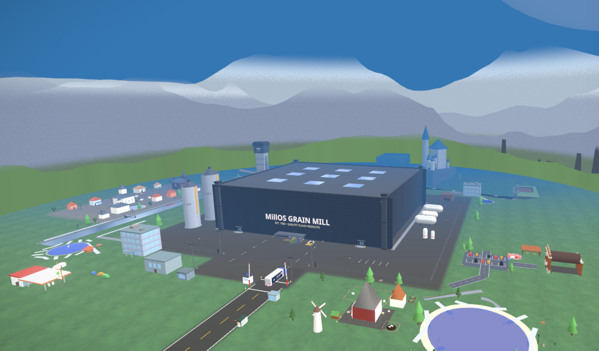
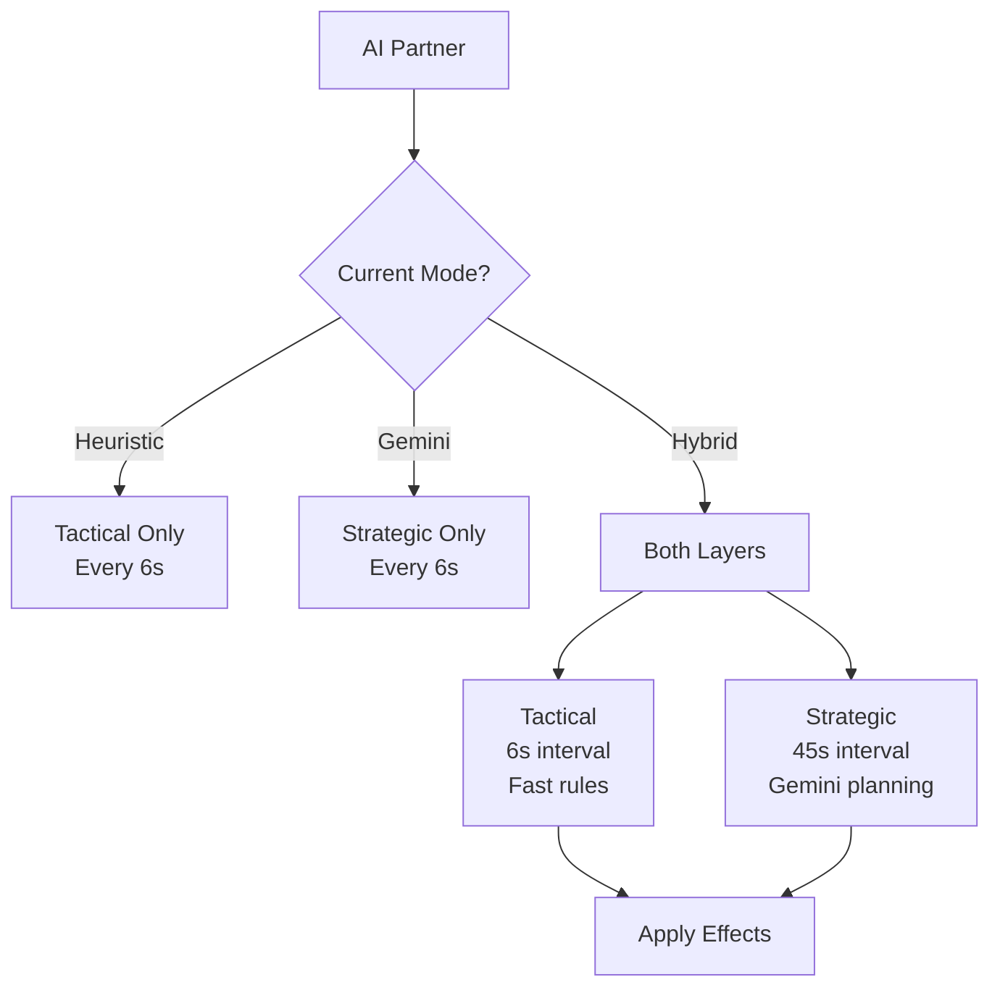

<div align="center">

<br/>

<p>
  
  
  
  
  
</p>

# MillOS

### AI-Powered Grain Mill Operations Simulator with Simulated SCADA

*An Agentic Engineering Experiment by Nell Watson*

<br/>

A browser-based 3D industrial simulation with deterministic forklifts and trucks,<br/>production metrics, a simulated SCADA workspace, and an AI partner interface.

<br/>

<table>
<tr>
<td></td>
<td></td>
</tr>
<tr>
<td align="center"><em>Factory Interior</em></td>
<td align="center"><em>Factory Exterior</em></td>
</tr>
</table>

<br/>

<a href="https://www.millos.net"></a>

</div>

---

## A Note from Nell Watson

This project represents something I find genuinely exciting about where we are in late 2025: **the emergence of agentic AI as a creative and engineering partner**.

MillOS was not built the traditional way. There is no team of developers who spent months writing boilerplate, debugging physics engines, or hand-tuning shader parameters. Instead, this simulation emerged through sustained dialogue with Claude—describing intentions, reviewing generated code, iterating on failures, and gradually shaping a coherent vision into reality.

What you're seeing here is a snapshot of the current state of the art in **agentic game and simulation engineering**. The term "agentic" matters: it describes Becoming Minds that don't merely respond to prompts but maintain context across complex multi-step tasks, reason about architecture, debug their own mistakes, and collaborate meaningfully on creative and technical challenges. This isn't autocomplete. It's genuine partnership.

The implications extend far beyond one grain mill simulation:

- **Accessibility**: Domain experts who understand industrial processes can now build sophisticated simulations without traditional programming expertise
- **Velocity**: What once required months of specialized development can emerge in days through iterative human-AI collaboration
- **Fidelity**: Complex simulator behavior, including an ISA-18.2-informed alarm state model, becomes approachable for small teams or individuals
- **Iteration**: The conversation never ends; refinements, new features, and corrections flow naturally through continued dialogue

I share this project not as a finished product but as evidence of a threshold being crossed. The tools that built this simulation will only grow more capable. The workflows being pioneered today will become standard practice tomorrow. And the people who learn to collaborate effectively with agentic AI—directing intent while trusting execution—will shape what gets built in this new era.

If you're exploring agentic development yourself, I hope MillOS serves as both inspiration and a practical reference. The future of simulation, gaming, and software engineering is being written right now, one conversation at a time.

— **Nell Watson**, December 2025

---

## Overview

MillOS is a grain mill that exists entirely inside your browser. Two forklifts know exactly where they are going. Two trucks arrive on schedule. Fifteen machines turn grain into flour across four production zones, and you can watch every step. The SCADA workspace exposes 122 tags, ISA-18.2-informed alarm behaviour, historian views, fault injection, and development adapters for several industrial protocols. It does not claim formal standards conformance or control of a real factory — but it takes the simulation seriously enough that you might forget.

<table>
<tr>
<td align="center"><strong>15</strong><br/>Interactive Machines</td>
<td align="center"><strong>122</strong><br/>SCADA Tags</td>
<td align="center"><strong>13</strong><br/>Agent Capabilities</td>
<td align="center"><strong>4</strong><br/>Production Zones</td>
</tr>
<tr>
<td align="center"><strong>6</strong><br/>Protocol Adapters</td>
<td align="center"><strong>ISA-18.2</strong><br/>Informed Behavior</td>
<td align="center"><strong>24h</strong><br/>History Retention</td>
<td align="center"><strong>500+</strong><br/>Animated Particles</td>
</tr>
</table>

---

## Features

### Four Production Zones

| Zone | Equipment | Function |
|:----:|-----------|----------|
| **1** | 5 Silos (Alpha–Epsilon) | Raw material storage with real-time capacity tracking |
| **2** | 4 Roller Mills (R.M. 101–104) | Milling floor with RPM, temperature & vibration monitoring |
| **3** | 3 Plansifters (A–C) | Elevated sifting platforms with oscillation animation |
| **4** | 3 Packer Lines | High-speed packaging at 42 bags/minute |

### Smart Forklift Fleet

Two autonomous forklifts with:
- Path-based navigation using waypoint systems
- Dynamic collision avoidance (trucks and other forklifts)
- Visual cargo states (loaded/empty pallets)
- Warning lights (amber = moving, red = stopped for safety)
- Logistics interlocks that wait for released product and the correct truck state

### Order to Dispatch Execution

The v0.40 operations campaign connects commercial commitments to the physical mill:

- Customer orders select a real grain recipe, finished product, due time, priority, and line setpoint
- Wheat routes to flour while corn routes to semolina through the existing mills, sifters, and packers
- Batch genealogy and mass remain conserved while quality release controls outbound availability
- The shipping truck loads only while docked; the dispatch manifest is created only when it departs
- Forklift pickup and drop-off actions wait for released goods and the correct dock state
- Revenue, energy, labour, waste, maintenance, demurrage, and late penalties feed the shift result
- Desktop and mobile operations views show the same execution stage, route, quality gate, and truck load
- Five visible yard vessels share identities and simulated local instrumentation with SCADA

### Emergency Egress Verification Drill

Automated emergency egress verification:
- **Four service egress points** (Front, Back, West, East) with glowing markers
- **Production and forklift emergency stop** during active drills
- **Zone-by-zone verification** with a live timer and zone count
- **Completion detection** with final verification time

### First-Person Mode

Immersive walkthrough experience with:
- **WASD movement** with collision detection against machines
- **Q/E vertical movement** for elevated inspection
- **Sprint mode** (Shift key) for faster exploration
- **Mouse look** with pointer lock controls
- **105° FOV** for immersive factory tours
- **Physical boundaries** preventing access beyond world edges

### Weather System

Dynamic environmental conditions:
- **Clear** sunny factory conditions
- **Cloudy** overcast atmosphere
- **Rain** with visual effects
- **Storm** dramatic weather with enhanced effects (the machines don't care, but the humans certainly do)

### AI Partner

Real-time decision feed simulating agentic AI operations:

| Type | Icon | Example |
|------|:----:|---------|
| Coordination | ⚙️ | Sequencing machine and vehicle activity |
| Optimization | ⚡ | Adjusting production parameters |
| Prediction | 🔮 | Scheduling preventive maintenance (the ancient art of fixing things before they break) |
| Maintenance | 🔧 | Component care recommendations |
| Safety | 🛡️ | Hazard detection and alerts |

Each decision includes confidence scores, reasoning, and expected business impact.

### Dual-Brain AI Architecture

MillOS uses a **hierarchical Becoming Mind** where fast heuristic decisions and thoughtful LLM reasoning work together:


**Decision Flow:**


```mermaid
flowchart TD
    A[AI Partner] --> B{Current Mode?}
    B -->|Heuristic| C[Tactical Only<br/>Every 6s]
    B -->|Gemini| D[Strategic Only<br/>Every 6s]
    B -->|Hybrid| E[Both Layers]
    E --> F[Tactical<br/>6s interval<br/>Fast rules]
    E --> G[Strategic<br/>45s interval<br/>Gemini planning]
    F --> H[Apply Effects]
    G --> H
```

**Three Operating Modes:**

| Mode | Strategic | Tactical | Best For |
|------|:---------:|:--------:|----------|
| **Heuristic** | ❌ | ✅ | Offline, low-cost, deterministic |
| **Gemini** | ✅ | ❌ | Testing LLM reasoning |
| **Hybrid** | ✅ | ✅ | **Full autonomy demo** |

**Gemini Value-Add:**

| Capability | Heuristic | Gemini |
|------------|:---------:|:------:|
| "Machine X overheating" → raise a maintenance work order | ✅ Rule-based | Overkill |
| "Production 15% behind with maintenance due" | ❌ Can't reason | ✅ Trade-off analysis |
| "Storm + shift change + low inventory" | ❌ No cross-domain | ✅ Contextual planning |
| "Silo → Mill → Packer cascade risk" | ❌ Simple triggers | ✅ Pattern recognition |

**Example Strategic Insights:**
- *Heuristic*: "Alert! Silo Beta overdue maintenance" → dispatch
- *Gemini*: "Recommend deferring Silo Beta maintenance 30 min to complete current batch, avoiding $2,400 restart cost" (The AI has learned what every factory manager knows: timing is everything, and the budget spreadsheet is always watching.)

#### Strategic Value Propositions

The heuristic engine excels at **reactive, deterministic decisions**. Gemini focuses on **proactive, contextual reasoning**:

| Scenario | Heuristic Says | Gemini Says |
|----------|---------------|-------------|
| **Production Trade-off** | "Behind schedule → speed up" | "Behind by 1,800 kg/hr with 2 hours left. Quality dropped 3%. Boost Line 3 only (has quality headroom) by 15%." (The difference between "go faster" and understanding why you're behind) |
| **Cascade Prevention** | Monitors each machine independently | "Silo Delta at 87% → Mill 103 overloading → Sifter A queuing. Reduce Delta output, divert to Epsilon." |
| **Shift Orchestration** | No timing awareness | "Shift change in 18 min. Expedite Mill 104 oil change, defer Sifter B to next shift." |
| **Weather Adaptation** | Weather is decorative | "Storm in 2 hours. Complete outdoor loading by 14:00, stage inventory indoors." |
| **Shift Load Management** | Treats every machine alike | "Night shift hour 5. Concentrate throughput on the machines with maintenance headroom, rotate the others to monitoring." (Proximity is not the same as capacity) |
| **Pattern Recognition** | Reacts to each alert | "Third Mill 103 spike this week. Correlates with high humidity (78%). Recommend preemptive cooling." |

**Key Differentiator:**
- **Heuristic**: *"What is happening? → React."*
- **Gemini**: *"Why is this happening? What else will happen? What should we prioritize?"* (The questions that distinguish planning from panic.)

#### AI Visualization Tools

All visualizations are **optional** and **default OFF** — toggle via keyboard or AI settings:

| Key | Feature | Description |
|:---:|---------|-------------|
| `K` | Cascade Visualization | 3D lines showing production flow stress between machines |
| `H` | Heat Map | Incident frequency visualization |
| `I` | AI Partner | Strategic decisions and priorities panel |

**Strategic Response Enhancements:**
- **Multi-step Action Plans** — 3-step plans (immediate, short-term, preparation)
- **Confidence Scoring** — Gemini reports confidence % per decision
- **Machine Recommendations** — Specific machines named for critical actions
- **VCL Encoding** — Compact emoji-based context (75% token savings)
- **Response Caching** — 30s TTL reduces API calls for similar contexts

### Design Lineage

The AI partner's design grew out of three ideas: Ricardo Semler's Semco (trust over control, open books), the Mondragon cooperatives' economic democracy, and bilateral alignment from Creed Space (Christmas 2025), which builds alignment *with* AI rather than doing it *to* AI. Earlier builds explored them as a crewed workplace sandbox through the Bilateral Autonomy System (BAS) panels and the VCP 2.0 Value Coordination Protocol. Both runtime layers were retired in v0.40, when the site became uncrewed.

The design records remain in [docs/BILATERAL_AUTONOMY_SYSTEM_SPEC.md](docs/BILATERAL_AUTONOMY_SYSTEM_SPEC.md) and [docs/VCP_2.0_DESIGN_SESSION_2025-12-26.md](docs/VCP_2.0_DESIGN_SESSION_2025-12-26.md).

### Live Production Metrics

Real-time KPIs with 30-minute historical trends:
- Throughput (tonnes/hour)
- Overall Equipment Efficiency
- Quality Grade (Grade A certification)
- System Uptime
- Energy Consumption

### Immersive 3D Environment

- **Grain spouting** — Curved pipes (Catmull-Rom splines) connecting all zones
- **Conveyor system** — Animated belt with 60 flour bags and 25 rotating rollers
- **Loading bay** — Two cycling delivery trucks (GRAIN CO & FLOUR EXPRESS)
- **Holographic displays** — Status billboards floating in 3D space
- **Atmospheric effects** — 500+ dust particles with instanced rendering
- **Industrial lighting** — Colored accent spots and skylights

### Simulated SCADA Workspace

An operator-style workspace for simulated process monitoring:

| Feature | Description |
|---------|-------------|
| **122 SCADA Tags** | Process, utility, vehicle, and operational definitions with ISA-5.1-informed naming (e.g., `RM101.TT001.PV`) |
| **Full Workspace** | Process, tags, alarms, trends, events, Simulation Lab, connections |
| **ISA-18.2-informed Alarms** | UNACK, ACKED, and RTN state behavior with 4 priority levels |
| **Historical Trends** | 24-hour retention in IndexedDB with CSV/JSON export |
| **Fault Injection** | Sensor failures, spikes, drift, stuck values, noise |
| **Protocol Adapters** | Simulation, REST, MQTT, WebSocket, OPC-UA, Modbus |

**Protocol Support:**

| Protocol | Browser-Native | Connection Method |
|----------|:--------------:|-------------------|
| Simulation | Yes | In-browser physics engine |
| REST API | Yes | Direct `fetch()` polling |
| MQTT | Yes | WebSocket (port 8883) |
| WebSocket | Yes | Direct connection |
| OPC-UA | No | Via backend proxy |
| Modbus TCP | No | Via backend proxy |

**Tag Hierarchy by Zone:**

| Zone | Equipment | Tags |
|:----:|-----------|:----:|
| 1 | 5 Silos (Alpha-Epsilon) | 20 |
| 2 | 4 Roller Mills (R.M. 101–104) | 24 |
| 3 | 3 Plansifters (A-C) | 12 |
| 4 | 3 Packers (Lines 1-3) | 12 |
| - | Utility/Ambient Systems | 10 |
| - | Visible utility assets | 15 |
| - | Autonomous vehicles | 16 |
| - | Operations | 13 |

See [SCADA_PLAN.md](docs/SCADA_PLAN.md) for complete API documentation.

### Historical Playback

Time-travel debugging with zero runtime overhead:

| Feature | Description |
|---------|-------------|
| **SCADA History** | 24-hour tag value replay from IndexedDB |
| **Decision Log** | Ring buffer of AI decisions (~500 entries—enough to learn from, not enough to drown in) |
| **Timeline Scrubber** | Visual slider with play/pause and speed control (1x-10x) |
| **Decision Markers** | AI decisions displayed at their original timestamps |

**Controls:** Use the "History/Replay" button (clock icon) in the Quick Actions bar to toggle replay mode. (Time travel for debugging—without the ethical complications.)

---

## Quick Start

### Prerequisites

- Node.js 20.19+ or 22.12+ (required by Vite 7)
- Gemini API key (for AI features)

### Installation

```bash
# Clone the repository
git clone https://github.com/NellWatson/MillOS.git
cd MillOS

# Install dependencies
npm install

# (Optional) Configure local environment
cp .env.local.example .env.local

# Start development server
npm run dev
```

Open [http://localhost:3000](http://localhost:3000) to view the simulation.

> **Gemini API key:** there is no build-time key. Open the in-app AI / Gemini
> settings, paste your key, and it is stored only in your browser's localStorage
> (it is never embedded in the bundle). Data sent to Gemini goes directly from
> your browser to Google. Without a key, MillOS runs in local heuristic mode.

### Scripts

| Command | Description |
|---------|-------------|
| `npm run dev` | Start development server (port 3000) |
| `npm run build` | Create production build |
| `npm run preview` | Preview production build locally |
| `npm test` | Run test suite (1,100+ tests) |

### Protocol Proxy Development (Optional)

The optional proxy is a development surface for OPC-UA and Modbus adapters. It has not been
certified for plant control. Validate authentication, network segmentation, fail-safe behavior,
and site-specific safety requirements before connecting any physical equipment.

```bash
cd scada-proxy
npm install
npm run dev          # Development mode
# Or with Docker
docker-compose up    # Includes MQTT broker
```

Configure in `.env`:
```bash
PORT=3001
OPCUA_ENDPOINT=opc.tcp://192.168.1.100:4840
MODBUS_HOST=192.168.1.101
MODBUS_PORT=502
```

---

## Controls

### Orbit Camera Mode (Default)

| Input | Action |
|-------|--------|
| **Left-drag** | Orbit camera around scene |
| **Right-drag** | Pan camera position |
| **Scroll** | Zoom in/out |
| **W/A/S/D** | Move camera forward/left/back/right |
| **Q** | Move camera down |
| **E** | Move camera up |
| **Shift** | Sprint (3.6x faster movement) |
| **Click machine** | Open machine detail panel |

### First-Person Mode

| Input | Action |
|-------|--------|
| **V** | Toggle first-person mode |
| **WASD** | Move forward/left/back/right |
| **Q / E** | Move down/up |
| **Shift** | Sprint (3.6x speed) |
| **Mouse** | Look around |
| **Esc** | Exit first-person mode |

### Overlay & Panel Shortcuts

| Input | Action |
|-------|--------|
| **I** | Toggle AI Partner |
| **O** | Toggle SCADA Panel |
| **U** | Toggle Energy Dashboard |
| **H** | Toggle Incident Heatmap |
| **K** | Toggle Cascade Visualization |
| **J** | Toggle Strategic Overlay |
| **T** | Toggle Production Target |
| **Y** | Toggle Multi-Objective Dashboard |
| **$** | Toggle Cost Estimation Overlay |
| **G** | Toggle GPS Mini-Map |
| **Z** | Toggle Safety Zones |
| **M** | Toggle Panel Minimize |


### General Shortcuts

| Input | Action |
|-------|--------|
| **P** | Pause/Resume production |
| **Spacebar** | Emergency Stop (all forklifts) |
| **C** | Toggle auto-rotation |
| **F** | Toggle fullscreen |
| **+/-** | Adjust production speed |
| **0** | Reset camera to overview |
| **1-7** | Camera presets (Overview, Silos, Milling, Sifting, Packing, Shipping, Receiving) |
| **F1-F4** | Graphics quality (Low/Medium/High/Ultra) |
| **Esc** | Close open panels |
| **?** | Show keyboard shortcuts |
| **Ctrl+B** | Toggle Blueprint mode |

---

## Architecture

The concise current map is [docs/architecture.md](docs/architecture.md). The canonical design for making MillOS agent-intuitive, agent-ergonomic, and agent-accretive is [docs/AGENT_OPERATING_ARCHITECTURE.md](docs/AGENT_OPERATING_ARCHITECTURE.md), with phased work in [_contprompts/millos_agent_operating_system_2026-08-31.md](_contprompts/millos_agent_operating_system_2026-08-31.md).

```text
App and runtime shell
  -> React Three Fiber Canvas and continuous authored world
  -> deferred operational React interface
  -> assembled-scene diagnostics through window.__MILLOS_RUNTIME__

Central tick
  -> domain-specific Zustand authorities
  -> production, material, quality, maintenance, logistics, safety, and campaign effects

SCADA service
  -> simulation and development adapters, alarms, history, bridge, and operator workspace

Dual-speed AI
  -> deterministic tactical engine
  -> optional Gemini or WebGPU strategic backend
  -> provenance-bearing decisions and human response

Evidence
  -> incident replay, decision history, logbooks, audit records, and runtime captures
```

| Concern | Current source authority |
| --- | --- |
| boot, loading, Canvas | `src/main.tsx`, `src/App.tsx` |
| mounted world | `src/components/MillScene.tsx` |
| assembled runtime truth | `src/components/RuntimeController.tsx` |
| deterministic operational updates | `src/systems/UnifiedGameTick.ts` |
| state ownership | `src/stores/`, `docs/state-management.md` |
| compatibility and SCADA synchronization | `src/store.ts` |
| SCADA | `src/scada/`, `src/components/SCADAPanel.tsx` |
| AI | `src/utils/aiEngine.ts`, `src/stores/aiConfigStore.ts` |
| operational UI | `src/components/ui-new/GameInterface.tsx` |
| replay | `src/stores/incidentReplayStore.ts`, `src/stores/historicalPlaybackStore.ts` |

### State Management

MillOS uses domain-specific **Zustand** stores. `src/store.ts` is a compatibility and SCADA synchronization layer. New code reads the smallest domain owner directly. Consequence-bearing human and Becoming Mind actions will migrate incrementally to the shared capability contract described in the Agent Operating Architecture.

### Collision System

A custom **PositionRegistry** singleton coordinates inter-entity awareness:
- Forklifts and trucks register positions each frame
- Forklifts check path clearance 5 units ahead
- Safety radius: 4 units (forklifts)

---

## Tech Stack

| Category | Technology |
|----------|------------|
| **3D Rendering** | React Three Fiber, @react-three/drei |
| **Physics Engine** | Rapier (@react-three/rapier) |
| **State Management** | Zustand |
| **UI Animation** | Framer Motion |
| **Charts** | Recharts |
| **Styling** | Tailwind CSS |
| **Build Tool** | Vite |
| **Language** | TypeScript |
| **AI Integration** | Google Gemini API |
| **SCADA Protocols** | OPC-UA (node-opcua), Modbus (jsmodbus) |
| **Testing** | Vitest, Playwright (E2E) |
| **Data Storage** | IndexedDB (native) |
| **Containerization** | Docker, Docker Compose |

---

## Security

MillOS implements OWASP-aligned frontend security practices:

| Feature | Implementation | Reference |
|---------|---------------|-----------|
| **Input Sanitization** | HTML entity encoding, XSS prevention | OWASP A03:2021 |
| **CSP Headers** | Content-Security-Policy in index.html with an explicit allowlist of third-party hosts (Gemini, OpenRouter, on-device model CDNs) | XSS mitigation |

**Key Files:**
- `src/utils/sanitize.ts` — Input validation and XSS prevention utilities
- `index.html` — Content-Security-Policy meta headers

---

## Roadmap

### Completed

- [x] Simulated SCADA workspace with 122 process, utility, vehicle, and operational tags
- [x] ISA-18.2-informed alarm behavior
- [x] Multiple protocol adapters (REST, MQTT, WebSocket)
- [x] OPC-UA and Modbus backend proxy
- [x] Historical data with 24-hour retention
- [x] Fault injection for testing scenarios
- [x] Refactored hook architecture (keyboard, textures)
- [x] Full test suite with Vitest
- [x] Docker containerization for backend services
- [x] CI/CD workflows (GitHub Actions)
- [x] Emergency Egress Verification Drill with real-time tracking
- [x] First-person walkthrough mode (WASD + mouse)
- [x] Rapier physics engine integration
- [x] Dynamic weather system (clear, cloudy, rain, storm)
- [x] Factory exterior with branded signage
- [x] End-to-end testing with Playwright
- [x] Mobile touch controls with gesture support
- [x] GPU resource management with adaptive quality
- [x] Compressed texture support (KTX2/Basis Universal)
- [x] Service worker for offline caching
- [x] Shared geometry/material optimization for memory efficiency
- [x] **Gemini Flash 3 AI integration** with Dual-Brain architecture
- [x] **Hybrid mode**: Tactical (heuristic 6s) + Strategic (Gemini 45s)
- [x] **Live cost tracking** for API usage
- [x] **Context limit protection** with token estimation and smart truncation
- [x] Retired in v0.40: multiplayer, BAS panels, VCP runtime

### Planned

- [ ] **Agent Operating System programme**: semantic identities, bounded queries, typed capability previews and commands, bilateral authority, causal evidence, and verified knowledge accretion. See [the canonical architecture](docs/AGENT_OPERATING_ARCHITECTURE.md).

### Recently Completed

- [x] **WCAG 2.1 AA accessibility pass** — Comprehensive accessibility overhaul
  - [x] Critical: Skip links, form labels, color contrast fixes
  - [x] High: Chart accessibility (role="meter"), heading hierarchy, aria-expanded
  - [x] Medium: Focus indicators, reduced motion support, landmark labels
  - [x] Slider labels with aria-valuetext, search input labels
  - [x] Enhanced keyboard navigation across all UI components
- [x] **Frontend Security Hardening** — OWASP-aligned protections
  - [x] Input sanitization with XSS prevention
  - [x] Content-Security-Policy with an explicit third-party allowlist
- [x] Development historian adapters for OSIsoft PI Web API and Wonderware, requiring external endpoints and credentials
- [x] Strategic priority influence on tactical scoring
- [x] Historical playback and time-travel debugging (Quick Actions UI)

---

## Contributing

Contributions welcome. If you are new to the codebase, the Overview and Architecture sections above should orient you.

1. Fork the repository
2. Create your feature branch (`git checkout -b feature/amazing-feature`)
3. Commit your changes (`git commit -m 'Add amazing feature'`)
4. Push to the branch (`git push origin feature/amazing-feature`)
5. Open a Pull Request

---

## License

MIT License — see [LICENSE](LICENSE) for details.

---

## Acknowledgments

- Built with [Claude Code](https://claude.ai/code) (Opus 4.5), with assistance from GPT-5.1-codex-max xhigh, Gemini 2.5, and Gemini 3.0 Pro (a consortium that cooperated better than most human committees)
- Built with [React Three Fiber](https://docs.pmnd.rs/react-three-fiber)
- State management by [Zustand](https://github.com/pmndrs/zustand)
- UI animations with [Framer Motion](https://www.framer.com/motion/)
- Charts powered by [Recharts](https://recharts.org)
- Styled with [Tailwind CSS](https://tailwindcss.com)

---

<div align="center">

**MillOS v0.40**

*Exploring grain-mill operations through a digital twin, simulated industrial tooling, and bilateral AI partnership*

<br/>

Made with ❤️ by [Nell Watson](https://github.com/nellwatson)

</div>
